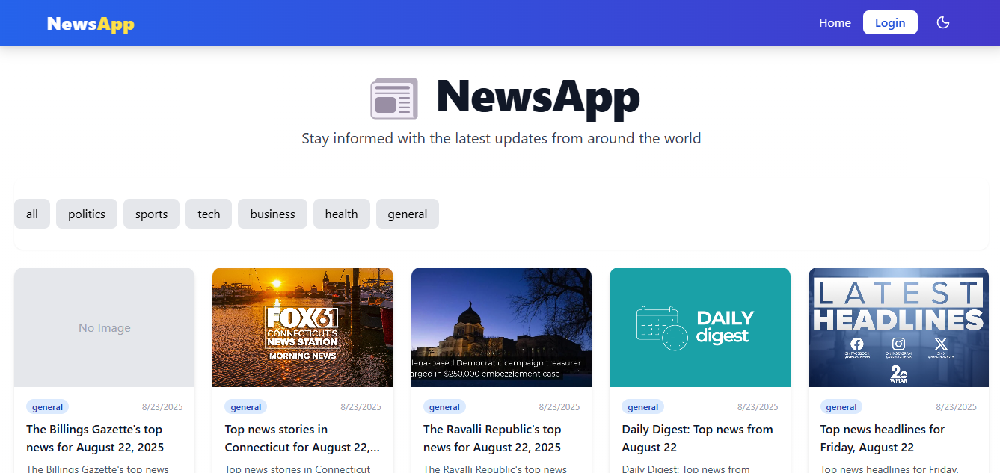
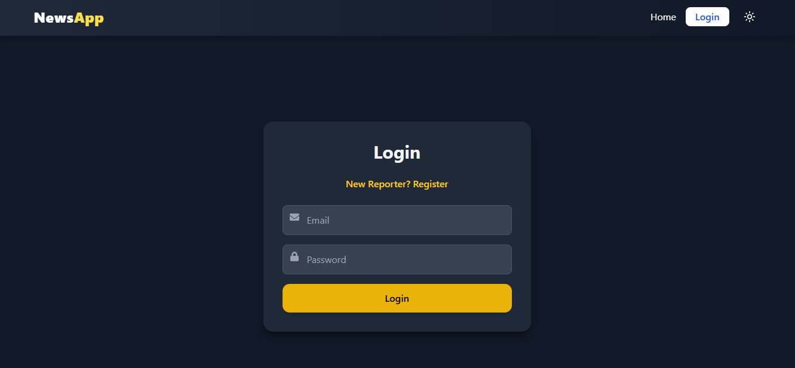

# 📰 NewsApp - MERN Stack News Platform


---

## **Project Overview**

NewsApp is a full-stack MERN (MongoDB, Express, React, Node.js) application that allows users to stay updated with the latest news from around the world.  
It includes features like:

- **Category-based news** filtering (Politics, Sports, Tech, Business, Health, General)
- **Login & Registration** system for Admin and Reporters
- **Dark & Light mode support**
- **Smooth scroll-to-top and scroll-to-bottom buttons**
- Responsive **UI/UX** for all devices

---

## **Screenshots**

### Light Mode




### Dark Mode


### Login / Register





---

## **Tech Stack**

- **Frontend:** React, Tailwind CSS, Framer Motion
- **Backend:** Node.js, Express.js
- **Database:** MongoDB
- **Authentication:** JWT (JSON Web Tokens)
- **Icons:** react-icons, lucide-react

---

## **Project Structure**

NewsApp/
│
├─ backend/ # Node.js + Express API
│ ├─ controllers/
│ ├─ models/
│ ├─ routes/
│ ├─ utils/
│ ├─ server.js
│ └─ package.json
│
├─ frontend/ # React app
│ ├─ src/
│ │ ├─ api/
│ │ ├─ components/
│ │ ├─ pages/
│ │ ├─ App.jsx
│ │ └─ index.js
│ ├─ public/
│ └─ package.json
│
├─ .gitignore
├─ README.md
└─ LICENSE

## Setup

1. Install dependencies

   ```bash
   npm install
   ```

2. Create `.env` file:(in frontend and backend)
   news-app-frontend

   ```.env
   VITE_API_BASE=http://localhost:5000/api
   ```

   news-app-backend

   ```.env
   PORT=5000
   MONGO_URI=mongodb://127.0.0.1:27017/newsapp
   JWT_SECRET=supersecret  (type secret string)
   SERAPI_KEY=######## (type api key)
   ```

3. Start development server:
   ```bash
   npm run dev
   ```

Frontend runs on: **http://localhost:5173**
